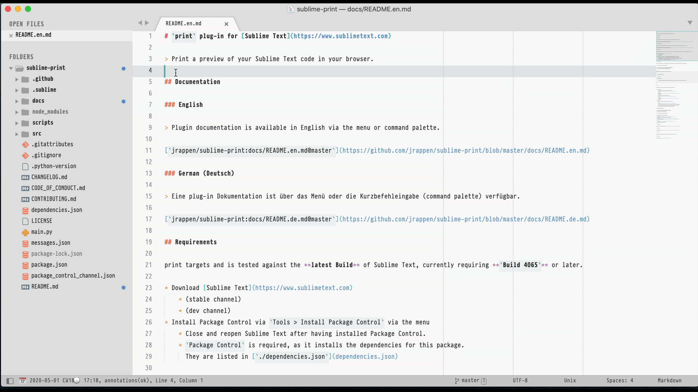
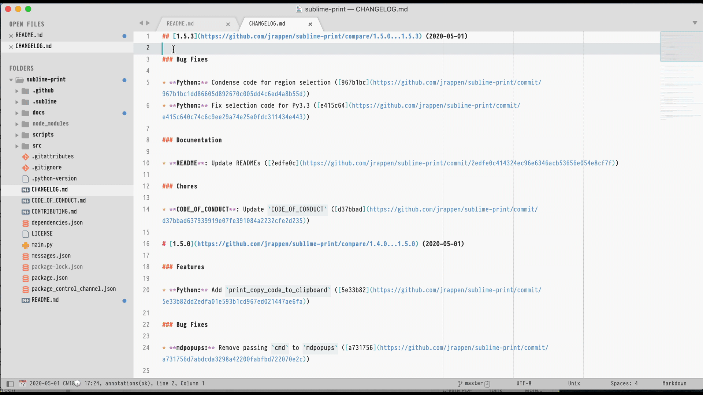

[](https://github.com/jrappen/sublime-print/blob/master/LICENSE)
[](https://www.sublimetext.com)
[](https://github.com/jrappen/sublime-print/tags)
[](https://discord.gg/D43Pecu)
[](https://www.paypal.me/jrappen)

# `print` plug-in for [Sublime Text](https://www.sublimetext.com)

> Print a preview of your Sublime Text code in your browser.

* [Documentation](#documentation)
* [Requirements](#requirements)
* [Installation](#installation)
* [Usage](#usage)
* [Source code](#source-code)
* [Donations](#donations)

## Documentation

> Plugin documentation is available via the menu or command palette.

* English:
  <https://github.com/jrappen/sublime-print/blob/master/docs/en/README.md>
* German (Deutsch):
  <https://github.com/jrappen/sublime-print/blob/master/docs/de/README.md>

### Code of conduct

<https://github.com/jrappen/.github/blob/master/CODE_OF_CONDUCT.md>

### Contributing guide

<https://github.com/jrappen/.github/blob/master/CONTRIBUTING.md>

## Requirements

print targets and is tested against the **latest Build** of Sublime Text, currently requiring **`Build 4074`** or later.

* Download [Sublime Text](https://www.sublimetext.com)
* Install Package Control via `Tools > Install Package Control` via the menu
    * Close and reopen Sublime Text after having installed Package Control.
    * `Package Control` is required, as it installs the dependencies for this package.

## Installation

Using **Package Control** is required,as it keeps your packages (with their dependencies) up-to-date!

### Installation via Package Control

* Open the Command Palette (`Tools > Command Palette`).
* Choose `Preferences: Package Control - User`.

```jsonc
//  Packages/User/Package Control.sublime-settings

{
    "installed_packages":
    [
        "print"
    ],
    "repositories":
    [
        "https://raw.githubusercontent.com/jrappen/sublime-print/master/package_control_channel.json"
    ]
}
```

## Usage

`print` generates a preview for printing your Sublime Text code.

You can:

* preview Markdown as HTML in Sublime
* preview Markdown as HTML in your default Browser
* preview highlighted code in your default Browser
* copy code to clipboard as highlighted HTML-code-snippet

Look for `Print: ...` in:

* the command palette (`Tools > Command Palette`)
* or the context menu (right-click)

### Usage: Preview Markdown in Sublime Text



### Usage: Preview Markdown in Browser



### Usage: Preview code in browser for printing


### Usage: Copy highlighted code snippet as mini-HTML


### Known issues with Markdown Preview

* the Markdown Preview is limited to
  [mini-HTML](https://www.sublimetext.com/docs/minihtml.html)
* HTML comments break the preview (at that point)
* [`mdpopups`](https://github.com/facelessuser/sublime-markdown-popups)
  uses [`python-markdown`](https://github.com/facelessuser/sublime-markdown)
  and
  [`pymdownx`](https://github.com/facelessuser/sublime-pymdownx)
  which use 4 spaces indentation

## Source Code

<https://www.github.com/jrappen/sublime-print>

### License

<https://github.com/jrappen/sublime-print/blob/master/LICENSE>

### Issues

Please use the command palette or the main menu to report an issue.

## Donations

<https://www.paypal.me/jrappen>
